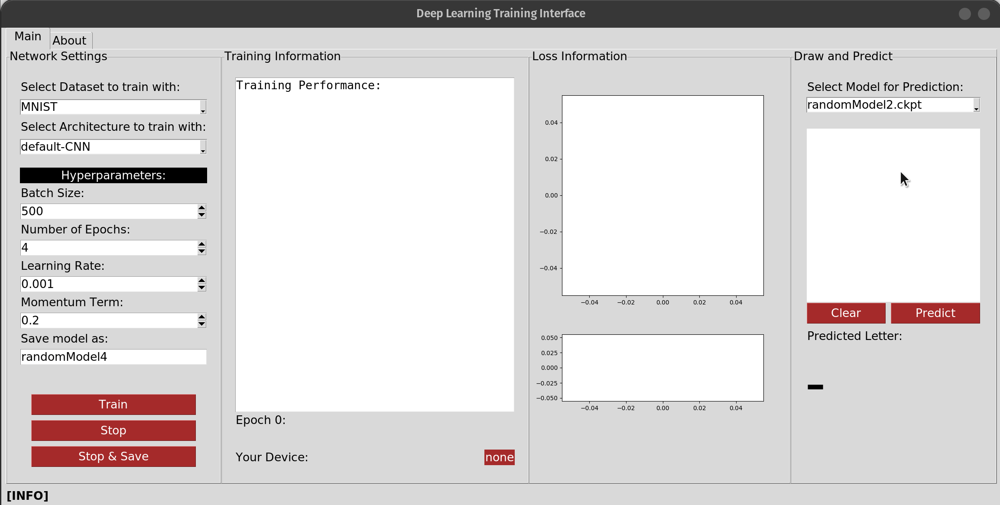

# Deep Learning Training Interface

This application allows you to play around with a Neural Network and its Hyper-parameters. You can easily change them by changing the values in the Boxes Text-fields. After that you can see a animated Loss-Graph with live updates!

## Usage
Run this application by just going to the main folder and executing `python3 main.py`.

## Main Features

### Train your Model:seedling:
You can train your model on one of the two datasets:
- **MNIST**: only digits from 1-9.
- **EMNIST**: every alphabetic letter and number (a-z, A-Z, 1-9).

Network Architecture Selection is **disabled** and will may come in the Future!

After Selecting one Dataset, you can play around with the [Hyperparameters](https://towardsdatascience.com/what-are-hyperparameters-and-how-to-tune-the-hyperparameters-in-a-deep-neural-network-d0604917584a) of the Neural Network. They will have a strong influence on the Training and Performance of the model, so choose wisely! After selecting all Hyper-parameters and a suitable name for the model, you can now start to Train your Model, by clicking on the `Start` Button.

You may find your Model overfitting during training, but no problem, you can Stop and Save your Model anytime!

### Console Log :pager:
This window functions as console and gives some information about the Status and Loss of your Model. At the bottom you can also see the progress of the training and which `device` is used. The `device` is selected automatically for you.

### Animated Loss Charts :chart_with_downwards_trend:
In this section you will see **two** graphs. The upper graph shows the loss in a more local manner, while the lower one shows the loss in the entire training span. In the DefaultCNN, the **cross-entrophy-loss** is used:

### Draw and Predict :pencil2:
Now its time to test your model! Select one of the models from the drop-down menu, draw a Number/Letter and click on the `predict` button. You will see you predicted label under the drawing field. Note that however, the predictions are somewhat bad for most models, beacuse the model most likely overfitts on the (E)MNIST dataset.

## Requirements
To execute this application, `python3` is required.
When executing the `main.py`, the program will fist check if all modules are installed.

| package     | version |
| ----------- | ------- |
| torch       | >= 1.7.1|
| torchvision | >= 0.8.2|
| numpy       | >= 1.18 |
| PIL         | >= 8.0  |
| tkinter     | >= 8.6  |

Note that `tkinter` is installed by default on `Windows10`, but not on `Linux`.
